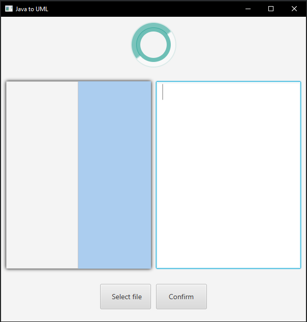

# Ditrobuted java analyzing tool

This a Java project for the Course: **DIT355 H18 Mini Project: Distributed Systems Development
**

The purpose of this system is to analyzse a java project folder and produces a UML class diagram.

### Table of contents
[TOC]

#### Benefits of the system

- Makings thing easier to see in an overview format
- Improves accessabilty by exporting the outcome as a picture.


#### Structure of systems directory

    Root/
         Visualization/
                        src/
                            MainPackage/
                                        NODE_Visualizer.java
         javaparser/
                    src/
                        Main/
                             NODE_parser.java
         client/
                src/
                    application/
                                NODE_client.java


#### How to run the program

```javascript
1. Make sure that you have access to an internet connection
2. Start a IDE of your choice
3. Import the root folder of the project named ( MiniProject-DistributedSystem )
4. Locate the three Java files shown in the in the diagram above in the IDE
5. Launch the NODE_Visualizer.java file inside the IDE
6. Launch the NODE_parser.java file inside the IDE
7. Launch the NODE_client.java file inside the IDE
```
If you have followed these steps you should have a window simmilar this:



```javascript
8. Then you click the Select file button ( This will bring up a file selection window )
9. Select a java project folder with the file selection window that you want to analyze ( The program will now analyze the project folder and give a Estimated time till completion.)
11. click the confirm button ( The program will not start to analyze your program and produce an image of your project)
12. The program is now producing the image , all you have to do is to wait. During the time the program is producing the image , it will show relevant information on what task it is doing, as well as how far along it is with that task,
```

When the program is done proccesing your project, it show a button in the left hand field of the program. By clicking this button , you will open up the image, seing the UML diagram created.

Here is an example image, that was created by using this project as an imput.

[example image](MiniProject-DistributedSystem.png "example image") ( the image is quite large , so it doesn't load instantly)

As you can see the image sizes can be quite large, if you have a large Java project. Here is another exmaple where a extremly large project was analyzed. [example image](Unit-01.png "example image")

#### Directory Logic:

In the root folder there is three folders which together comprisses the entire project.

    Root/
         Visualization/
         javaparser/
         client/

Each of these folders acts as an independent project, and can be run on the different computers,
but they have to be on the same network.

Each of the folders share identic classes to communcate with each other. They shared classes are stored
inside folders.
The folders that are the same accross the projects are [TCP](client/src/TCP "TCP") and [FileClasses](client/src/TCP "FileClasses").
They are structured like this:

    Root/
         one of the three folders/
                                    src/
                                        FileClasses/
                                        TCP/


#### Documentation:
Links to documents containing documentation: [SRS](MiniProject-DistributedSystem.png "SRS"), [SDS](MiniProject-DistributedSystem.png "SDS")
Link to contribution : [Trello](https://trello.com/miniprojectdistributedsystem "Trello")
